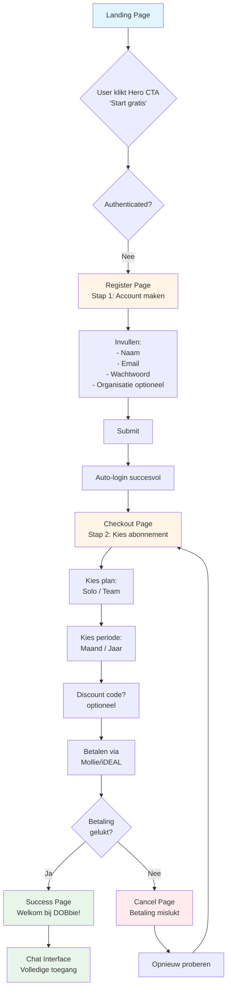

# Nieuwe Gebruiker Flow (Happy Path)

Complete flow voor een nieuwe gebruiker van landing page tot chat interface.

## Flow Beschrijving

### Stap 1: Landing Page
- User landt op homepage
- Ziet Hero CTA "Start gratis" of "Start nu"

### Stap 2: Registratie
- Niet-geauthenticeerde users worden naar register page gestuurd
- Invullen van basisgegevens: naam, email, wachtwoord, organisatie (optioneel)
- Na submit: automatische login

### Stap 3: Checkout
- Direct na registratie redirect naar checkout
- User kiest abonnement (Solo/Team)
- Kiest facturatie periode (Maand/Jaar)
- Optioneel: discount code invullen
- Betaling via Mollie/iDEAL

### Stap 4: Betaling
- Bij succes: redirect naar success page
- Bij cancel: redirect naar cancel page met retry optie

### Stap 5: Chat Interface
- Na succesvolle betaling: volledige toegang tot chat
- Subscription status = 'active'

## Belangrijke Notes

- **Auto-login**: Na registratie wordt gebruiker automatisch ingelogd
- **Query parameters**: Checkout krijgt `?new=true` na registratie
- **Fail-safe**: Bij betaling problemen kan gebruiker opnieuw proberen
- **Status tracking**: Subscription status wordt via webhook ge-update
