# Bestaande Gebruiker Login Flow

Complete login flow met alle mogelijke subscription status checks.

```mermaid
flowchart TD
    Start[Landing Page] --> LoginClick{User klikt<br/>'Inloggen'}
    LoginClick --> LoginPage[Login Page]
    LoginPage --> Credentials[Invullen:<br/>Email + Wachtwoord]
    Credentials --> Submit[Submit]

    Submit --> AuthCheck{Credentials<br/>correct?}
    AuthCheck -->|Nee| Error[Error bericht]
    Error --> LoginPage

    AuthCheck -->|Ja| GetProfile[Haal profile op<br/>subscription_status]
    GetProfile --> StatusCheck{Status check}

    StatusCheck -->|active| ChatDirect[Direct naar Chat<br/>✅ Toegang]
    StatusCheck -->|trial actief| ChatTrial[Naar Chat<br/>⏰ Met trial banner]
    StatusCheck -->|trial verlopen| CheckoutExpired[Checkout Page<br/>?expired=true]
    StatusCheck -->|inactive| CheckoutRenew[Checkout Page<br/>?renew=true]

    CheckoutExpired --> Payment[Betaalflow]
    CheckoutRenew --> Payment
    Payment --> PaySuccess{Betaling<br/>succesvol?}
    PaySuccess -->|Ja| ChatAccess[Chat Interface<br/>✅ Toegang]
    PaySuccess -->|Nee| CancelPage[Cancel Page]

    style LoginPage fill:#fff4e6
    style ChatDirect fill:#e8f5e9
    style ChatTrial fill:#fff9c4
    style ChatAccess fill:#e8f5e9
    style CheckoutExpired fill:#ffe0b2
    style CheckoutRenew fill:#ffe0b2
    style CancelPage fill:#ffebee
```

## Subscription Status Scenario's

### 1. Active Subscription ✅
- **Status**: `subscription_status = 'active'`
- **Actie**: Direct naar `/chat`
- **UX**: Geen blokkades, volledige toegang

### 2. Trial Actief ⏰
- **Status**: `subscription_status = 'trial'` EN `trial_end_date > now()`
- **Actie**: Naar `/chat` met trial banner
- **UX**: Banner toont "Nog X dagen trial over"

### 3. Trial Verlopen ⚠️
- **Status**: `subscription_status = 'trial'` EN `trial_end_date < now()`
- **Actie**: Redirect naar `/checkout?expired=true`
- **UX**: Melding "Je trial is afgelopen, kies een abonnement"

### 4. Inactive (Nooit Betaald) 💳
- **Status**: `subscription_status = 'inactive'`
- **Actie**: Redirect naar `/checkout?renew=true`
- **UX**: "Kies een abonnement om DOBbie te gebruiken"

### 5. Expired (Was Actief) ⏰
- **Status**: `subscription_status = 'expired'`
- **Actie**: Redirect naar `/checkout?renew=true`
- **UX**: "Je abonnement is verlopen, verleng je abonnement"

## Error Handling

### Onjuiste Credentials
- Error message: "Onjuiste inloggegevens"
- User blijft op login page
- Kan opnieuw proberen

### Database Error bij Profile Check
- Fail-open strategie: allow access
- Log error voor monitoring
- Voorkomt blokkade bij technische problemen

## Redirect Parameters

- `?expired=true` - Trial of subscription verlopen
- `?renew=true` - Algemene renewal (inactive/expired)
- Parameters worden bewaard door checkout flow
