# Smart CTA Routing Logica

Intelligente routing voor alle "Start nu" / "Start gratis" buttons op de website.

```mermaid
flowchart TD
    CTA[User klikt CTA<br/>'Start nu' / 'Start gratis']
    CTA --> Auth{Is user<br/>authenticated?}

    Auth -->|Nee| Register[→ /register]

    Auth -->|Ja| GetProfile[Check profile<br/>subscription_status]
    GetProfile --> HasActive{Status?}

    HasActive -->|active| ToChat[→ /chat<br/>Direct toegang ✅]
    HasActive -->|trial + niet verlopen| ToChat
    HasActive -->|trial verlopen| ToCheckoutExpired[→ /checkout?expired=true<br/>Trial afgelopen ⏰]
    HasActive -->|inactive| ToCheckoutRenew[→ /checkout?renew=true<br/>Nog niet betaald 💳]
    HasActive -->|expired| ToCheckoutRenew

    style Register fill:#fff4e6
    style ToChat fill:#e8f5e9
    style ToCheckoutExpired fill:#ffe0b2
    style ToCheckoutRenew fill:#ffe0b2
```



## Implementatie

### Component: SmartCTA
**Locatie**: `src/components/common/SmartCTA.tsx`

### Gebruik
```tsx
import { SmartCTA } from '@/components/common/SmartCTA';

// In Hero section
<SmartCTA className="btn-primary">
  Start gratis
</SmartCTA>

// In Header
<SmartCTA className="btn-header">
  Start nu
</SmartCTA>
```

## Routing Beslissingen

### Niet Geauthenticeerd
- **Doel**: Nieuwe user acquisitie
- **Actie**: → `/register`
- **Rationale**: Account aanmaken is eerste stap

### Authenticated + Active/Trial
- **Doel**: Minimale wrijving voor betalende users
- **Actie**: → `/chat` (direct toegang)
- **Rationale**: User heeft al toegang, geen extra stappen

### Authenticated + Expired/Inactive
- **Doel**: Conversie naar betaling
- **Actie**: → `/checkout` met context parameter
- **Rationale**: User kent product al, direct naar betaling

## Status Checks

### Trial Check Logic
```typescript
const isTrialActive =
  profile.subscription_status === 'trial' &&
  profile.trial_end_date &&
  new Date(profile.trial_end_date) > new Date();
```

### Active Check Logic
```typescript
const hasAccess =
  profile.subscription_status === 'active' || isTrialActive;
```

## Waar Gebruikt

1. **Landing Page Hero** - Primaire CTA
2. **Header Navigatie** - "Start nu" button
3. **Pricing Section** - "Kies plan" buttons (optioneel)
4. **Footer** - CTA links (optioneel)

## Performance Considerations

- **Client-side check**: Gebeurt in browser
- **Caching**: User status kan gecached worden (kort TTL)
- **Loading state**: Toont spinner tijdens check
- **Fallback**: Bij error → `/register`
